# 🚀 ExecFi Automatic Deployment Guide

## Overview

This project uses **Watchtower** for automatic deployment. When you push code to GitHub, it automatically builds and deploys to your VPS.

## 📋 Prerequisites

- ✅ VPS running Docker & Docker Compose
- ✅ GitHub Personal Access Token (PAT) with `read:packages` permission
- ✅ Domain: execfi.xyz pointing to 31.97.110.176

---

## 🎯 Quick Setup (First Time)

### **On Your Local Machine:**

```bash
# 1. Copy setup script to VPS
scp deploy-setup.sh execfi@31.97.110.176:~/

# 2. Copy docker-compose file
scp docker-compose.prod.yml execfi@31.97.110.176:~/execfi/
```

### **On Your VPS:**

```bash
# 1. SSH to VPS
ssh execfi@31.97.110.176

# 2. Run setup script
chmod +x ~/deploy-setup.sh
./deploy-setup.sh

# Follow the prompts:
# - Enter GitHub username
# - Enter GitHub PAT (create at: https://github.com/settings/tokens)
#   Required permission: read:packages
```

That's it! 🎉

---

## 🔄 Deployment Workflow

```mermaid
graph LR
    A[Push to GitHub] --> B[GitHub Actions]
    B --> C[Build Docker Image]
    C --> D[Push to GHCR]
    D --> E[Watchtower Detects]
    E --> F[Pull New Image]
    F --> G[Restart Container]
    G --> H[Live! 🎉]
```



### **Step by Step:**

1. **You push code:**
   ```bash
   git add .
   git commit -m "feat: new feature"
   git push origin main
   ```

2. **GitHub Actions builds image:**
   - Runs tests (if configured)
   - Builds Docker image
   - Pushes to `ghcr.io/flux-layer/execfi:staging`
   - Takes ~2-3 minutes

3. **Watchtower detects update:**
   - Checks every 5 minutes
   - Detects new image digest
   - Pulls new image

4. **Automatic deployment:**
   - Gracefully stops old container
   - Starts new container
   - Cleans up old image
   - Takes ~30 seconds

5. **Your app is live!**
   - Zero downtime
   - Automatic rollout
   - Old images cleaned up

**Total time:** ~5-10 minutes from push to production

---

## 📊 Monitor Deployment

### **Watch Deployment in Real-Time:**

```bash
# SSH to VPS
ssh execfi@31.97.110.176

# Watch watchtower logs
docker logs watchtower -f

# You'll see:
# ✅ "Checking image for execfi-app"
# ✅ "Found new image"
# ✅ "Stopping container"
# ✅ "Starting container"
# ✅ "Removing old image"
```

### **Verify App is Running:**

```bash
# Check container status
docker ps

# Check app response
curl http://localhost:3290

# Check from outside
curl http://31.97.110.176:3290
```

---

## 🛠️ Common Commands

### **View Logs:**

```bash
# App logs
docker compose -f ~/execfi/docker-compose.prod.yml logs -f execfi

# Watchtower logs
docker logs watchtower -f

# Last 100 lines
docker compose -f ~/execfi/docker-compose.prod.yml logs --tail=100
```

### **Manual Update:**

```bash
cd ~/execfi
docker pull ghcr.io/flux-layer/execfi:staging
docker compose -f docker-compose.prod.yml up -d --force-recreate
```

### **Restart Services:**

```bash
# Restart app only
docker restart execfi-app

# Restart all
docker compose -f ~/execfi/docker-compose.prod.yml restart
```

---

## 🎮 GitHub Actions

### **Workflow File:** `.github/workflows/deploy-staging.yml`

**Triggers on:**
- Push to `main` branch
- Push to `staging` branch
- Push to `bugfix/*` branches

**What it does:**
1. Checks out code
2. Sets up Docker Buildx
3. Logs into GitHub Container Registry
4. Builds image with caching
5. Pushes to `ghcr.io/flux-layer/execfi:staging`
6. Notifies deployment status

### **View Build Status:**

Visit: https://github.com/flux-layer/execfi/actions

---

## 🔐 Security

### **GitHub Token Permissions:**

**For VPS (Watchtower):**
- Needs: `read:packages`
- Used to: Pull Docker images from GHCR

**For GitHub Actions:**
- Uses: `${{ secrets.GITHUB_TOKEN }}`
- Auto-provided by GitHub
- Has: `packages:write` permission

### **Best Practices:**

✅ Use minimal permissions (read:packages for VPS)  
✅ Store PAT in Docker config, not in code  
✅ Use `unless-stopped` restart policy  
✅ Enable Watchtower cleanup  
✅ Monitor logs regularly  

---

## 🐛 Troubleshooting

### **Watchtower Not Updating:**

```bash
# Check watchtower logs
docker logs watchtower

# Common issues:
# 1. Authentication expired
docker login ghcr.io

# 2. Image not accessible
docker pull ghcr.io/flux-layer/execfi:staging

# 3. Restart watchtower
docker restart watchtower
```

### **Build Failed on GitHub Actions:**

1. Check Actions tab: https://github.com/flux-layer/execfi/actions
2. Click on failed workflow
3. Check error logs
4. Common issues:
   - Build errors (fix code)
   - Tests failing (fix tests)
   - Docker build timeout (optimize Dockerfile)

### **App Not Starting:**

```bash
# Check container logs
docker logs execfi-app

# Check if port is in use
sudo netstat -tulpn | grep 3290

# Restart container
docker restart execfi-app
```

### **Can't Access from Browser:**

1. Check app is running: `docker ps`
2. Check port binding: `netstat -tulpn | grep 3290`
3. Check nginx: `sudo systemctl status nginx`
4. Check firewall: `sudo ufw status`
5. Check DNS: `nslookup execfi.xyz`

---

## 📈 Configuration

### **Watchtower Settings:**

| Setting | Value | Purpose |
|---------|-------|---------|
| `WATCHTOWER_POLL_INTERVAL` | 300 | Check every 5 minutes |
| `WATCHTOWER_CLEANUP` | true | Remove old images |
| `WATCHTOWER_LABEL_ENABLE` | true | Only watch labeled containers |
| `WATCHTOWER_ROLLING_RESTART` | true | Zero-downtime updates |

### **Modify Settings:**

```bash
# Edit docker-compose.prod.yml
nano ~/execfi/docker-compose.prod.yml

# Restart watchtower
docker compose -f ~/execfi/docker-compose.prod.yml restart watchtower
```

---

## 🎯 Testing Deployment

### **Test the Full Pipeline:**

1. **Make a small change:**
   ```bash
   echo "console.log('Deployment test')" >> src/test.js
   git add .
   git commit -m "test: deployment pipeline"
   git push origin main
   ```

2. **Watch GitHub Actions:**
   - Go to: https://github.com/flux-layer/execfi/actions
   - Wait for build to complete (~2-3 minutes)

3. **Watch Watchtower:**
   ```bash
   ssh execfi@31.97.110.176
   docker logs watchtower -f
   ```
   - Wait up to 5 minutes for update detection

4. **Verify Deployment:**
   ```bash
   # Check new container is running
   docker ps
   
   # Check logs for your test message
   docker logs execfi-app | grep "Deployment test"
   ```

**Success!** 🎉 Your deployment pipeline is working!

---

## 🆘 Emergency Procedures

### **Rollback to Previous Version:**

```bash
# 1. List images
docker images | grep execfi

# 2. Stop current container
docker stop execfi-app
docker rm execfi-app

# 3. Start previous version
docker run -d --name execfi-app \
  -p 3290:3290 \
  --restart unless-stopped \
  ghcr.io/flux-layer/execfi@sha256:PREVIOUS_SHA \
  --label com.centurylinklabs.watchtower.enable=true
```

### **Disable Auto-Deployment:**

```bash
# Stop watchtower
docker stop watchtower

# Re-enable later
docker start watchtower
```

---

## 📚 Additional Resources

- **Watchtower:** https://containrrr.dev/watchtower/
- **GitHub Packages:** https://docs.github.com/en/packages
- **Docker Compose:** https://docs.docker.com/compose/
- **Full Command Reference:** See `vps-commands.md`

---

## ✅ Checklist

**Initial Setup:**
- [ ] VPS has Docker & Docker Compose installed
- [ ] GitHub PAT created with `read:packages` permission
- [ ] `deploy-setup.sh` script run successfully
- [ ] Watchtower container running
- [ ] App container running
- [ ] Can access app at http://31.97.110.176:3290

**Deployment:**
- [ ] GitHub Actions workflow configured
- [ ] Push triggers GitHub Actions build
- [ ] Image pushed to GHCR successfully
- [ ] Watchtower detects and pulls new image
- [ ] Container updates automatically
- [ ] App accessible after update

**Monitoring:**
- [ ] Know how to view logs
- [ ] Know how to check container status
- [ ] Can watch deployment in real-time
- [ ] Understand rollback procedure

---

**Need Help?**

1. Check logs: `docker compose -f ~/execfi/docker-compose.prod.yml logs`
2. Check GitHub Actions: https://github.com/flux-layer/execfi/actions
3. Refer to: `vps-commands.md` for detailed commands

**🎉 Happy Deploying!**
